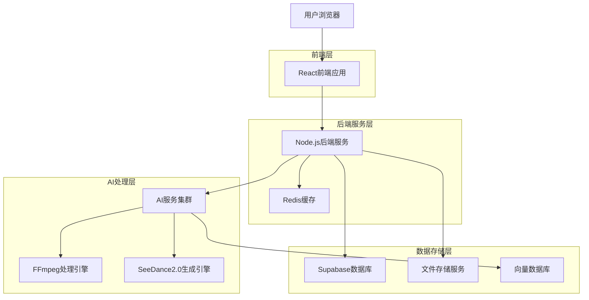
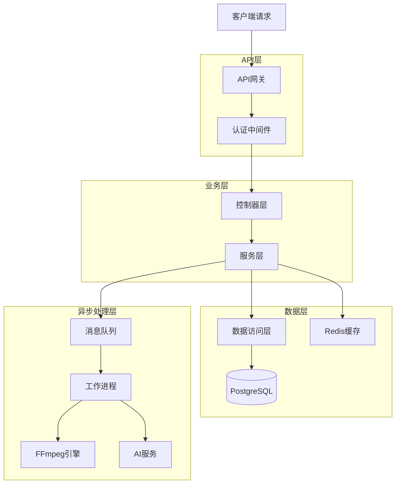
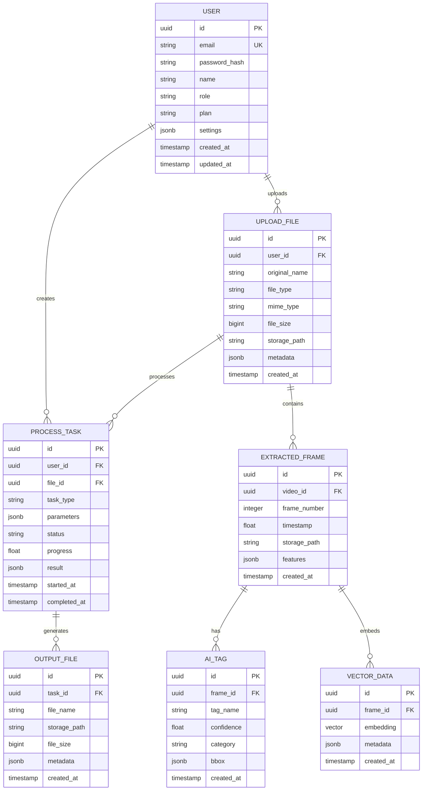

## 1. 架构设计



## 2. 技术描述

- **前端**: React@18 + TypeScript + TailwindCSS@3 + Vite
- **初始化工具**: vite-init
- **后端**: Node.js@20 + Express@4 + TypeScript
- **数据库**: Supabase (PostgreSQL)
- **缓存**: Redis@7
- **文件存储**: Supabase Storage + 阿里云OSS
- **AI框架**: Python@3.9 + PyTorch@2.0
- **视频处理**: FFmpeg@6.0
- **视频生成**: SeeDance2.0
- **向量检索**: Milvus@2.3

## 3. 路由定义

| 路由 | 用途 |
|------|------|
| / | 首页，功能导航和上传入口 |
| /upload | 文件上传页面，支持拖拽和批量上传 |
| /process | 处理工作台，实时预览和参数调整 |
| /ai-create | AI创作中心，抽帧打标和视频生成 |
| /results | 结果管理页面，文件下载和历史记录 |
| /profile | 用户中心，个人设置和使用统计 |
| /login | 用户登录页面 |
| /register | 用户注册页面 |
| /admin | 管理后台，用户和资源管理 |

## 4. API定义

### 4.1 文件上传API

```
POST /api/upload
```

请求参数：
| 参数名 | 类型 | 必需 | 描述 |
|--------|------|------|------|
| files | File[] | 是 | 上传的文件数组 |
| type | string | 是 | 文件类型: video/image |
| preset | string | 否 | 预设配置名称 |

响应：
| 参数名 | 类型 | 描述 |
|--------|------|------|
| uploadIds | string[] | 上传文件ID数组 |
| status | string | 上传状态 |

### 4.2 视频处理API

```
POST /api/process/video
```

请求参数：
| 参数名 | 类型 | 必需 | 描述 |
|--------|------|------|------|
| uploadId | string | 是 | 文件上传ID |
| operation | string | 是 | 操作类型: compress/resize/smart-scale |
| params | object | 是 | 处理参数对象 |

响应：
| 参数名 | 类型 | 描述 |
|--------|------|------|
| taskId | string | 处理任务ID |
| status | string | 任务状态 |
| progress | number | 处理进度百分比 |

### 4.3 AI抽帧API

```
POST /api/ai/extract-frames
```

请求参数：
| 参数名 | 类型 | 必需 | 描述 |
|--------|------|------|------|
| videoId | string | 是 | 视频文件ID |
| frameRate | number | 否 | 抽帧频率，默认1fps |
| quality | string | 否 | 图片质量: high/medium/low |

响应：
| 参数名 | 类型 | 描述 |
|--------|------|------|
| frames | object[] | 抽帧结果数组，包含时间戳和文件ID |
| tags | string[] | AI识别的标签数组 |

### 4.4 向量检索API

```
POST /api/ai/vector-search
```

请求参数：
| 参数名 | 类型 | 必需 | 描述 |
|--------|------|------|------|
| query | string | 是 | 查询文本或图片ID |
| limit | number | 否 | 返回结果数量，默认10 |
| threshold | number | 否 | 相似度阈值，默认0.7 |

响应：
| 参数名 | 类型 | 描述 |
|--------|------|------|
| results | object[] | 检索结果，包含相似度和文件信息 |

### 4.5 AI视频生成API

```
POST /api/ai/generate-video
```

请求参数：
| 参数名 | 类型 | 必需 | 描述 |
|--------|------|------|------|
| referenceFrames | string[] | 是 | 参考帧ID数组 |
| prompt | string | 是 | 生成提示词 |
| model | string | 否 | 模型类型: seedance2.0 |
| duration | number | 否 | 视频时长(秒)，默认10 |

响应：
| 参数名 | 类型 | 描述 |
|--------|------|------|
| taskId | string | 生成任务ID |
| estimatedTime | number | 预估完成时间(秒) |

## 5. 服务器架构图



## 6. 数据模型

### 6.1 数据模型定义



### 6.2 数据定义语言

用户表 (users)
```sql
CREATE TABLE users (
    id UUID PRIMARY KEY DEFAULT gen_random_uuid(),
    email VARCHAR(255) UNIQUE NOT NULL,
    password_hash VARCHAR(255) NOT NULL,
    name VARCHAR(100) NOT NULL,
    role VARCHAR(20) DEFAULT 'user' CHECK (role IN ('user', 'admin')),
    plan VARCHAR(20) DEFAULT 'free' CHECK (plan IN ('free', 'premium', 'enterprise')),
    settings JSONB DEFAULT '{}',
    created_at TIMESTAMP WITH TIME ZONE DEFAULT NOW(),
    updated_at TIMESTAMP WITH TIME ZONE DEFAULT NOW()
);

CREATE INDEX idx_users_email ON users(email);
CREATE INDEX idx_users_role ON users(role);
```

上传文件表 (upload_files)
```sql
CREATE TABLE upload_files (
    id UUID PRIMARY KEY DEFAULT gen_random_uuid(),
    user_id UUID NOT NULL REFERENCES users(id) ON DELETE CASCADE,
    original_name VARCHAR(255) NOT NULL,
    file_type VARCHAR(20) NOT NULL CHECK (file_type IN ('video', 'image')),
    mime_type VARCHAR(100) NOT NULL,
    file_size BIGINT NOT NULL,
    storage_path VARCHAR(500) NOT NULL,
    metadata JSONB DEFAULT '{}',
    created_at TIMESTAMP WITH TIME ZONE DEFAULT NOW()
);

CREATE INDEX idx_upload_files_user_id ON upload_files(user_id);
CREATE INDEX idx_upload_files_file_type ON upload_files(file_type);
CREATE INDEX idx_upload_files_created_at ON upload_files(created_at DESC);
```

处理任务表 (process_tasks)
```sql
CREATE TABLE process_tasks (
    id UUID PRIMARY KEY DEFAULT gen_random_uuid(),
    user_id UUID NOT NULL REFERENCES users(id) ON DELETE CASCADE,
    file_id UUID NOT NULL REFERENCES upload_files(id) ON DELETE CASCADE,
    task_type VARCHAR(50) NOT NULL CHECK (task_type IN ('compress', 'resize', 'smart-scale', 'extract-frames', 'generate-video')),
    parameters JSONB NOT NULL DEFAULT '{}',
    status VARCHAR(20) DEFAULT 'pending' CHECK (status IN ('pending', 'processing', 'completed', 'failed')),
    progress FLOAT DEFAULT 0 CHECK (progress >= 0 AND progress <= 100),
    result JSONB DEFAULT '{}',
    started_at TIMESTAMP WITH TIME ZONE,
    completed_at TIMESTAMP WITH TIME ZONE,
    created_at TIMESTAMP WITH TIME ZONE DEFAULT NOW()
);

CREATE INDEX idx_process_tasks_user_id ON process_tasks(user_id);
CREATE INDEX idx_process_tasks_file_id ON process_tasks(file_id);
CREATE INDEX idx_process_tasks_status ON process_tasks(status);
CREATE INDEX idx_process_tasks_created_at ON process_tasks(created_at DESC);
```

-- 权限设置
GRANT SELECT ON ALL TABLES IN SCHEMA public TO anon;
GRANT ALL PRIVILEGES ON ALL TABLES IN SCHEMA public TO authenticated;
GRANT ALL PRIVILEGES ON ALL SEQUENCES IN SCHEMA public TO authenticated;