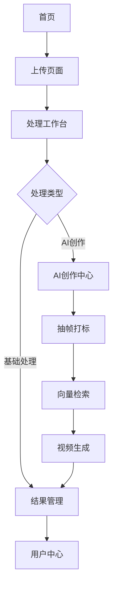

## 1. 产品概述
一个全链路视频与图像处理平台，支持视频压缩、图像缩放、批量处理、智能缩放、视频抽帧打标、向量检索和AI二次创作生成。

面向内容创作者、视频编辑师和AI爱好者，提供从原始素材到成品视频的一站式处理解决方案。

## 2. 核心功能

### 2.1 用户角色
| 角色 | 注册方式 | 核心权限 |
|------|----------|----------|
| 普通用户 | 邮箱注册 | 基础压缩、缩放功能，每日处理限制 |
| 高级用户 | 订阅升级 | 批量处理、AI功能、无限制使用 |
| 管理员 | 后台创建 | 系统管理、用户管理、资源监控 |

### 2.2 功能模块
平台包含以下核心页面：
1. **首页**: 功能导航、上传入口、处理进度概览
2. **上传页面**: 文件上传、参数预设、批量操作
3. **处理工作台**: 实时处理、参数调整、预览对比
4. **AI创作中心**: 抽帧打标、向量检索、提示词编辑、视频生成
5. **结果管理**: 文件下载、历史记录、分享链接
6. **用户中心**: 个人设置、使用统计、订阅管理

### 2.3 页面详情
| 页面名称 | 模块名称 | 功能描述 |
|----------|----------|----------|
| 首页 | 功能导航 | 展示所有处理功能入口，支持拖拽上传 |
| 首页 | 进度概览 | 显示当前处理任务状态和完成度 |
| 上传页面 | 文件上传 | 支持视频、图片批量上传，显示文件信息 |
| 上传页面 | 参数预设 | 提供压缩率、分辨率、格式等预设选项 |
| 处理工作台 | 实时处理 | 显示处理进度，支持暂停、取消操作 |
| 处理工作台 | 预览对比 | 原文件与处理结果实时对比展示 |
| 处理工作台 | 参数调整 | 处理过程中可动态调整参数 |
| AI创作中心 | 视频抽帧 | 自动提取关键帧，支持帧率设置 |
| AI创作中心 | 智能打标 | AI识别内容并自动生成标签 |
| AI创作中心 | 向量检索 | 基于内容的相似图片检索 |
| AI创作中心 | 提示词编辑 | 文本模型提示词编写和优化 |
| AI创作中心 | 视频生成 | 基于seedance2.0的AI视频生成 |
| 结果管理 | 文件下载 | 批量下载处理结果，支持多种格式 |
| 结果管理 | 历史记录 | 按时间、类型筛选历史处理记录 |
| 结果管理 | 分享链接 | 生成临时分享链接，设置有效期 |
| 用户中心 | 个人设置 | 头像、昵称、通知偏好设置 |
| 用户中心 | 使用统计 | 处理文件数量、存储空间使用统计 |
| 用户中心 | 订阅管理 | 升级订阅、支付方式管理 |

## 3. 核心流程

### 普通用户流程
用户进入首页 → 选择处理功能 → 上传文件 → 设置参数 → 开始处理 → 预览结果 → 下载文件

### AI创作流程
上传长视频 → 自动抽帧 → AI打标签 → 向量化存储 → 输入需求提示词 → 向量检索匹配 → AI视频生成 → 结果预览 → 下载成品

## 4. 用户界面设计

### 4.1 设计风格
- **主色调**: 深蓝色 (#1E3A8A) 配白色背景
- **辅助色**: 橙色 (#F97316) 用于强调和按钮
- **按钮风格**: 圆角矩形，悬浮效果，扁平化设计
- **字体**: Inter 字体族，标题18px，正文14px
- **布局风格**: 卡片式布局，左侧导航，右侧内容区
- **图标风格**: 使用Heroicons线性图标，简洁现代

### 4.2 页面设计概览
| 页面名称 | 模块名称 | UI元素 |
|----------|----------|----------|
| 首页 | 功能导航 | 网格布局展示功能卡片，每个卡片包含图标、标题、描述，悬停时有缩放动画 |
| 上传页面 | 文件上传 | 拖拽区域虚线边框，上传时显示进度条和文件列表，支持多文件同时上传 |
| 处理工作台 | 实时处理 | 分栏布局，左侧原文件预览，右侧处理结果，底部进度条和参数面板 |
| AI创作中心 | 抽帧展示 | 时间轴形式展示提取的帧，支持点击放大查看，标签以徽章形式显示 |
| 结果管理 | 文件列表 | 表格形式展示处理历史，包含缩略图、文件名、大小、处理时间、操作按钮 |

### 4.3 响应式设计
- **桌面优先**: 主要面向桌面端用户，支持1920x1080及以上分辨率
- **移动端适配**: 支持平板和手机端访问，采用响应式网格布局
- **触摸优化**: 移动端支持手势操作，如双指缩放、滑动切换等

### 4.4 处理进度可视化
- 圆形进度条显示处理百分比
- 实时日志输出，显示当前处理步骤
- 预估剩余时间显示
- 处理完成后声音提示