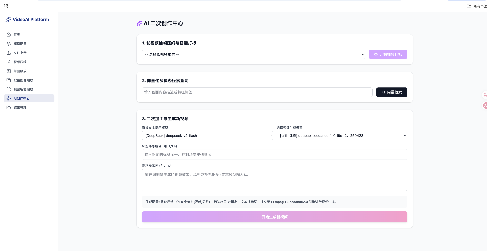
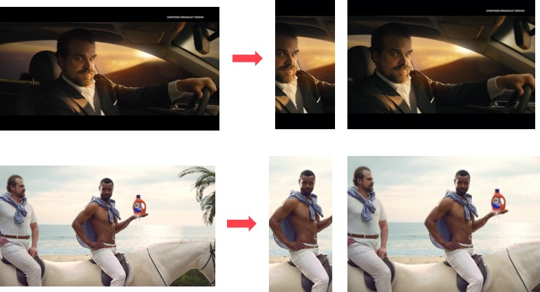

# PixelCraft

<div align="center">
  
  <p><strong>一个强大的Python库，用于自动化视频关键帧提取、视频压缩、智能图像裁剪和调整大小，以及AI驱动的视频生成。</strong></p>
</div>

## ✨ 功能特性

- ✅ **视频关键帧提取**：自动从视频中提取最具代表性的关键帧
- ✅ **视频压缩**：高效压缩视频文件，减小文件大小
- ✅ **智能图像裁剪**：基于边缘、显著性和人脸特征的智能裁剪
- ✅ **智能图像调整大小**：保持视觉内容的智能调整大小
- ✅ **AI视频生成**：使用AI生成新视频内容
- ✅ **批量处理**：支持批量处理多个视频和图像
- ✅ **Web界面**：提供现代化的React前端界面

## 🖼️ 功能展示

### 页面主页



### 视频压缩


### 单图缩放 / 视频抽帧



### 视频再创作


## 📦 安装

### 使用PyPI安装

```bash
pip install pixelcraft
```

### 从源码安装

```bash
# 克隆仓库
git clone https://github.com/Mdz-Bigdata/PixelCraft.git

# 进入项目目录
cd PixelCraft

# 安装依赖
pip install -r requirements.txt

# 安装项目
python setup.py install
```

### 可选依赖（AI功能）

```bash
pip install "pixelcraft[ai]"
```

## 🚀 快速开始

### 1. 视频关键帧提取

```python
import os
from PixelCraft.video import Video
from PixelCraft.writer import KeyFrameDiskWriter

# 初始化视频模块
vd = Video()

# 提取关键帧
no_of_frames = 12
video_file_path = "tests/data/pos_video.mp4"

# 使用磁盘写入器保存关键帧
diskwriter = KeyFrameDiskWriter(location="selectedframes")

# 提取关键帧
vd.extract_video_keyframes(
    no_of_frames=no_of_frames,
    file_path=video_file_path,
    writer=diskwriter
)

# 从目录中批量提取关键帧
vd.extract_keyframes_from_videos_dir(
    no_of_frames=no_of_frames,
    dir_path="tests/data",
    writer=diskwriter
)
```

**关键帧提取原理：**

- LUV色彩空间差异检测
- 亮度评分过滤
- 熵/对比度评分
- K-Means聚类
- 基于拉普拉斯方差的模糊检测

### 2. 智能图像裁剪

```python
import os
from PixelCraft.image import Image
from PixelCraft.writer import ImageCropDiskWriter

# 初始化图像模块
img_module = Image()

# 裁剪单张图像
image_file_path = "tests/data/bird_img_for_crop.jpg"
output_folder = "selectedcrops"

# 设置裁剪参数
crop_width = 300
crop_height = 400
no_of_crops = 3

# 使用磁盘写入器保存裁剪结果
diskwriter = ImageCropDiskWriter(location=output_folder)

# 裁剪图像（指定尺寸）
img_module.crop_image(
    file_path=image_file_path,
    crop_width=crop_width,
    crop_height=crop_height,
    num_of_crops=no_of_crops,
    writer=diskwriter,
    filters=["text"],
    down_sample_factor=8
)

# 按比例裁剪
img_module.crop_image_with_aspect(
    file_path=image_file_path,
    crop_aspect_ratio="9:16",
    num_of_crops=no_of_crops,
    writer=diskwriter
)

# 从目录批量裁剪
img_module.crop_image_from_dir(
    dir_path="tests/data",
    crop_width=crop_width,
    crop_height=crop_height,
    num_of_crops=no_of_crops,
    writer=diskwriter
)
```

**智能裁剪特性：**

- 边缘特征检测
- 显著性检测
- 人脸特征检测
- 文本过滤（避免截断文本）
- 三分法则构图优化

### 3. 图像调整大小

```python
import os
from PixelCraft.image import Image

# 初始化图像模块
img_module = Image()

# 调整图像大小
image_file_path = "tests/data/bird_img_for_crop.jpg"
output_folder = "resizedimages"

if not os.path.isdir(output_folder):
    os.mkdir(output_folder)

# 调整大小
resize_width = 500
resize_height = 600

resized_image = img_module.resize_image(
    file_path=image_file_path,
    target_width=resize_width,
    target_height=resize_height,
    down_sample_factor=8
)

# 保存图像到磁盘
img_module.save_image_to_disk(
    resized_image,
    file_path=output_folder,
    file_name="resized_image",
    file_ext=".jpeg"
)
```

### 4. 视频压缩

```python
import os
from PixelCraft.video import Video

# 初始化视频模块
vd = Video()

# 压缩视频
video_file_path = "tests/data/pos_video.mp4"
output_folder = "compressed_folder"

if not os.path.isdir(output_folder):
    os.mkdir(output_folder)

# 压缩单个视频
status = vd.compress_video(
    file_path=video_file_path,
    out_dir_path=output_folder
)

# 批量压缩目录中的视频
status = vd.compress_videos_from_dir(
    dir_path="tests/data",
    force_overwrite=True,
    out_dir_path=output_folder
)
```

### 5. AI视频生成（可选功能）

```python
from PixelCraft.video_ai import VideoAI

# 初始化AI模块
ai_module = VideoAI()

# 生成视频（需要安装AI依赖）
# ai_module.generate_video(...)
```

## 📜 运行示例脚本

项目提供了多个示例脚本：

```bash
# 视频关键帧提取示例
python example_video.py

# 图像裁剪示例
python example_image.py

# 图像调整大小示例
python example_image_resize.py

# 从目录批量调整图像大小
python example_image_resize_from_dir.py

# 视频压缩示例
python example_video_compression.py

# 视频智能调整大小示例（需要MediaPipe）
python example_video_smart_resize.py

# AI视频生成示例
python example_ai_video.py
```

## 💻 Web界面

### 启动开发服务器

```bash
# 安装前端依赖
npm install

# 同时启动前端和后端开发服务器
npm run dev

# 或者分别启动
npm run client:dev   # 仅前端
npm run server:dev   # 仅后端
```

### 构建生产版本

```bash
npm run build
```

### 访问端口：<http://localhost:5173>

### Web界面功能

- 📤 文件上传
- 🎬 视频处理（关键帧提取、压缩）
- 🖼️ 图像处理（裁剪、调整大小）
- 🤖 AI视频生成
- 📊 批量处理

## 📁 项目结构

```
PixelCraft/
├── PixelCraft/              # 核心Python库
│   ├── __init__.py
│   ├── image.py            # 图像处理模块
│   ├── video.py           # 视频处理模块
│   ├── video_ai.py        # AI视频生成模块
│   ├── video_compressor.py # 视频压缩模块
│   ├── writer.py          # 数据写入模块
│   ├── config.py          # 配置文件
│   ├── version.py         # 版本信息
│   ├── mediapipe.py       # MediaPipe集成
│   ├── crop_extractor.py  # 裁剪提取器
│   ├── crop_selector.py   # 裁剪选择器
│   ├── frame_extractor.py # 帧提取器
│   ├── helper_functions.py # 辅助函数
│   ├── image_selector.py  # 图像选择器
│   ├── exceptions.py      # 异常处理
│   ├── decorators.py      # 装饰器
│   ├── feature_list.py    # 特征列表
│   ├── filter_list.py     # 过滤器列表
│   ├── image_features/    # 图像特征提取
│   │   ├── __init__.py
│   │   ├── feature.py
│   │   ├── edge_feature.py
│   │   ├── face_feature.py
│   │   └── saliency_feature.py
│   └── image_filters/     # 图像过滤器
│       ├── __init__.py
│       ├── filter.py
│       └── text_detector.py
├── backend/               # 后端服务
│   ├── src/
│   │   ├── index.ts
│   │   ├── db/
│   │   ├── routes/
│   │   └── services/
│   ├── package.json
│   └── tsconfig.json
├── frontend/              # 前端界面
│   ├── src/
│   │   ├── components/
│   │   ├── pages/
│   │   ├── App.tsx
│   │   └── main.tsx
│   ├── public/
│   ├── package.json
│   └── vite.config.ts
├── tests/                # 测试文件
│   ├── __init__.py
│   ├── test_image.py
│   ├── test_all_video.py
│   ├── image_similarity.py
│   └── data/            # 测试数据
├── docs/                 # 文档
│   ├── source/
│   │   ├── index.rst
│   │   ├── installation.rst
│   │   ├── tutorials_image.rst
│   │   ├── tutorials_video.rst
│   │   ├── understanding_pixelcraft.rst
│   │   ├── how_to_guide.rst
│   │   ├── debugging_pixelcraft.rst
│   │   ├── troubleshooting.rst
│   │   ├── modules.rst
│   │   ├── conf.py
│   │   ├── logo.png
│   │   └── images/
│   ├── Makefile
│   └── make.bat
├── python_service/        # Python服务
├── uploads/              # 上传文件目录
├── selectedframes/       # 提取的关键帧
├── example_ai_video.py   # AI视频生成示例
├── example_image.py      # 图像裁剪示例
├── example_image_resize.py # 图像调整大小示例
├── example_image_resize_from_dir.py # 批量调整大小示例
├── example_video.py      # 视频关键帧提取示例
├── example_video_compression.py # 视频压缩示例
├── example_video_smart_resize.py # 视频智能调整大小示例
├── setup.py              # 安装脚本
├── setup.cfg             # 配置文件
├── requirements.txt      # 依赖列表
├── pixelcraft.yml        # Conda环境
├── package.json          # Node依赖
├── vite.config.ts        # Vite配置
├── tailwind.config.js    # Tailwind配置
├── LICENSE.txt           # 许可证
├── UPGRADE_GUIDE.md      # 升级指南
└── README.md            # 本文档
```

## 🛠️ 技术栈

### 后端 (Python)

- **OpenCV**: 图像处理和计算机视觉
- **NumPy**: 数值计算
- **SciPy**: 科学计算
- **scikit-learn**: 机器学习和聚类
- **scikit-image**: 高级图像处理
- **FFmpeg (imageio-ffmpeg)**: 视频处理
- **FFmpy**: FFmpeg的Python包装
- **PyTorch**: 深度学习框架（可选）
- **Diffusers**: 扩散模型（可选）
- **Transformers**: Transformer模型（可选）
- **Accelerate**: 加速训练和推理（可选）
- **Pillow**: 图像处理（可选）
- **Imutils**: 图像工具
- **Requests**: HTTP请求

### 前端 (React)

- **React 18**: 用户界面库
- **TypeScript**: 类型安全的JavaScript
- **Vite**: 快速的构建工具
- **Tailwind CSS**: 实用优先的CSS框架
- **React Router**: 客户端路由
- **Zustand**: 状态管理
- **Lucide React**: 图标库
- **Express**: 后端框架
- **Supabase**: 后端服务（可选）

## 🐍 Python版本支持

- Python 3.8
- Python 3.9
- Python 3.10
- Python 3.11
- Python 3.12
- Python 3.13
- Python 3.14

## 📚 文档

完整的文档可以在 [PixelCraft Read the Docs](https://pixelcraft.readthedocs.io) 查看，包括：

- 安装指南
- 图像教程
- 视频教程
- 理解PixelCraft
- 如何指南
- 调试指南
- 故障排除
- API参考

## 🧪 测试

运行测试：

```bash
pytest tests/
```

## 📄 许可证

本项目使用 MIT 许可证 - 详见 [LICENSE.txt](LICENSE.txt) 文件。

```
The MIT License (MIT)

Copyright (c) 2019 keplerlab

Permission is hereby granted, free of charge, to any person obtaining a copy
of this software and associated documentation files (the "Software"), to deal
in the Software without restriction, including without limitation the rights
to use, copy, modify, merge, publish, distribute, sublicense, and/or sell
copies of the Software, and to permit persons to whom the Software is
furnished to do so, subject to the following conditions:

The above copyright notice and this permission notice shall be included in all
copies or substantial portions of the Software.
```

## 🤝 贡献

欢迎贡献！请随时提交 Pull Request 或报告 Issue。

### 贡献步骤

1. Fork 本仓库
2. 创建你的特性分支 (`git checkout -b feature/AmazingFeature`)
3. 提交你的更改 (`git commit -m 'Add some AmazingFeature'`)
4. 推送到分支 (`git push origin feature/AmazingFeature`)
5. 开启一个 Pull Request

## 👥 作者

**keplerlab**

## 📬 联系方式

- GitHub: [https://github.com/](https://github.com/dz-Bigdata/PixelCraft)
- wechat: D1435221412

## 🙏 致谢

- OpenCV 社区
- FFmpeg 项目
- MediaPipe 项目
- 所有贡献者

***

